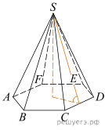

# Тип 2 [№27181](https://math-ege.sdamgia.ru/problem?id=27181)

Сторона основания правильной шестиугольной пирамиды равна 4, 
а угол между боковой гранью и основанием равен 45°. Найдите объем пирамиды.

