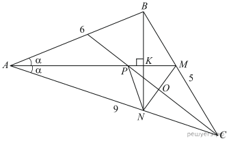

1) Обозначим K точку пересечения отрезков AM и BN. Треугольник ABN равнобедренный, так как в нем AK является биссектрисой и высотой. Следовательно, AK является и медианой, то есть K  — середина BN. Получаем, что AN = AB = 6, откуда NC  =  AC − AN  =  3. Рассмотрим треугольник ABC, биссектриса делит противоположную сторону на отрезки, пропорциональные прилежащим сторонам: BM : MC = AB : AC, учитывая, что длина BC равна 5, получаем: BM = 2; MC = 3. В треугольнике MNC стороны NC и MC равны, следовательно, треугольник MNC  — равнобедренный, с основанием MN. Значит, биссектриса угла C также является медианой и высотой. Таким образом, получаем, что биссектриса угла С делит отрезок MN пополам.
2) Рассмотрим треугольник PMN: отрезок PO перпендикулярен прямой MN и делит её пополам, следовательно, треугольник PMN  — равнобедренный с основанием MN. Значит, PM = PN и отношение AP : PN = AP : PM. В треугольнике AMC отрезок CP  — биссектриса, поэтому AP:PM = AC:MC = **3:1**.

